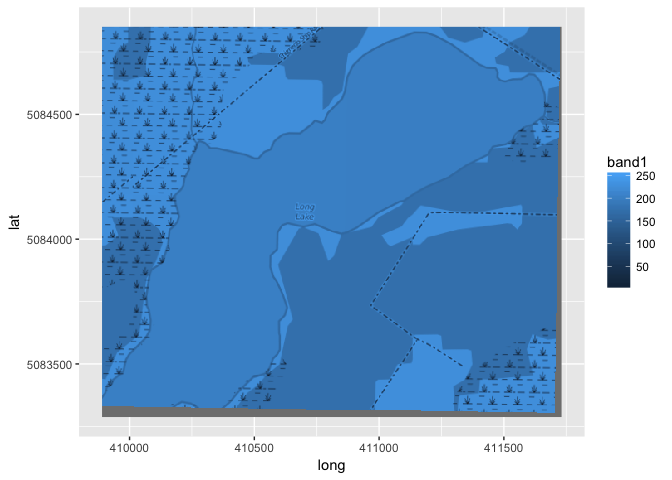
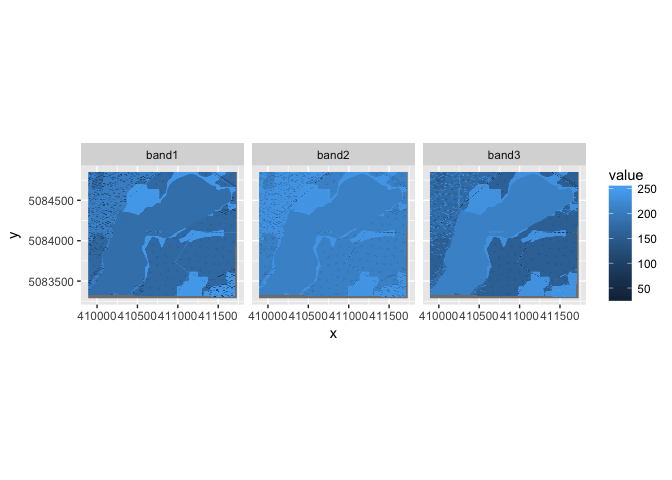
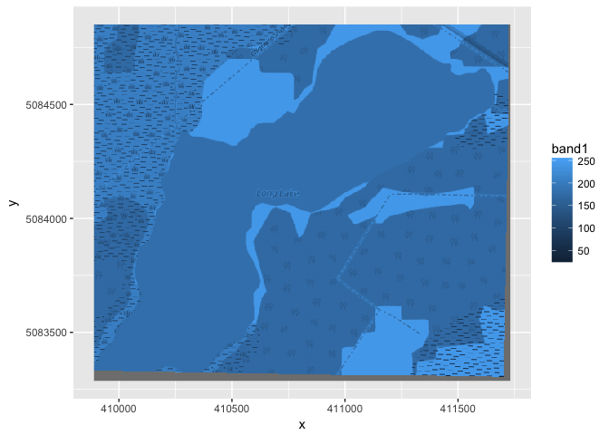
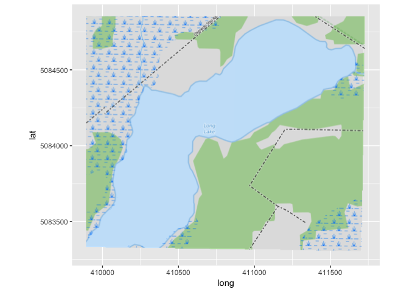

ggspatial: Spatial data framework for ggplot2
================
Dewey Dunnington
March 30, 2017

Spatial data plus the power of the `ggplot2` framework means easier mapping when input data are already in the form of `Spatial*` objects (most spatial data in R).

Installation
------------

The package is available on CRAN, and can be installed using `install.packages("ggspatial")`. The development version can be installed via `devtools`.

``` r
install.packages("devtools") # if devtools isn't installed
devtools::install_github("paleolimbot/ggspatial")
```

Introduction
------------

The `ggspatial` package provides several functions to convert spatial objects to `ggplot2` layers. There are three cases: vector data (`geom_spatial()` or `ggspatial()`), raster data (`geom_spatial()` or `ggraster()`), and tiled basemap (`geom_osm()` or `ggosm()`). Their usage is *almost* identical to normal ggplot `geom_*` functions, except that the mapping and the data arguments are switched (usually `mapping` comes before `data`, but in this context, where the type of the object determines the method that gets called, it makes more sense for `data` to come first). Almost every call you make within this package will be:

``` r
library(ggspatial)
ggplot(...) + [ geom_osm() + ] # geom_osm is optional
  geom_spatial(spatial_object, ...) +
  ... +
  coord_map()
```

To save on typing, there are a few shortcuts. The first is where a `geom_spatial` is the first layer: for this, you can use `ggspatial(spatial_object, ...)`, which is short for `ggplot() + geom_spatial(spatial_object, ...) + coord_map()`.

``` r
library(ggspatial)
```

    ## Warning: package 'ggplot2' was built under R version 3.2.5

    ## Warning: package 'sp' was built under R version 3.2.5

``` r
ggspatial(longlake_waterdf, fill = "lightblue")
```


Generally, a `geom_osm()` is your first layer. For this, you can use `ggosm()`, which is short for `ggplot() + geom_osm() + coord_map()`. In fact, `geom_osm()` *only* works using `coord_map()`, since tiles are projected and not in lat/lon coordinates.

``` r
ggosm() + 
  geom_spatial(longlake_waterdf, fill = "red", alpha = 0.25)
```


Notice that `geom_osm()` doesn't need any arguments. Cool, right!? For more information, see `?geom_spatial` and `?geom_osm`. Now on to more mundane details...

Spatial objects
---------------

Many (but not all) objects of type `Spatial*` can be used with `ggplot` using the `fortify()` family, but syntax is inconsistent and results vary. This package introduces a single `geom_` for use with `Spatial*` objects (e.g. `SpatialPointsDataFrame`, `SpatialLinesDataFrame`, `SpatialPolygonsDataFrame`...essentially what you get when you use `rgdal::readOGR()` or `maptools::readShapeSpatial()` to read any kind of spatial data). A few spatial objects are included in the package as examples, namely the `longlake_*` series of layers that I used to create my honours thesis figures (a distressingly long time ago, I may add).

``` r
library(ggspatial)
data(longlake_waterdf)
ggplot() + 
  geom_spatial(longlake_waterdf, fill="lightblue") + 
  coord_map()
```


If we examine `longlake_waterdf`, we can use the columns as aesthetics just as we would for a normal `data.frame`.

``` r
ggplot() + 
  geom_spatial(longlake_waterdf, aes(fill=label)) + 
  coord_map()
```


A more useful use of this may be to examine a depth survey from Long Lake I took on for my honours thesis.

``` r
data(longlake_depthdf)
ggplot() + geom_spatial(longlake_waterdf[2,], fill="lightblue") +
  geom_spatial(longlake_depthdf, aes(col=DEPTH.M), size=2) + 
  scale_color_gradient(low = "red", high = "blue") +
  coord_map()
```


Projections
-----------

If you've been trying this at home, you may have noticed that you get a little message for every non-lat/lon dataset you try to plot. `geom_spatial()` is spatially aware, and if you don't tell it otherwise, it will convert all of your input data to lat/lon. I made this the default because `ggplot` has the nice `coord_map()` function that helpfully projects things that happen to be in lat/lon format (and communicates your intent clearly). If you're working in the polar regions or near the international date line, it's unlikely that this what you want. To get around the default projection, you can specify your own using `crsto` (see also `?as.CRS`). For example, the previous plot could be rendered to the Google Mercator projection by passing `crsto=3857` (note that you'll have to do this for all the layers).

``` r
data(longlake_depthdf)
ggplot() + 
  geom_spatial(longlake_waterdf[2,], fill="lightblue", 
               crsto=3857) +
  geom_spatial(longlake_depthdf, aes(col=DEPTH.M), size=2,
               crsto=3857) +
  scale_color_gradient(low = "red", high = "blue")
```


Open Street Map Basemaps
------------------------

Using the [rosm package](https://github.com/paleolimbot/rosm), `ggspatial` can load Open Street Map tiles (among other tile sources) automatically as a backdrop for your other data (provided your data are in lat/lon, or are converted to such using `geom_spatial()`). Note that here we use `ggosm(...)` instead of `ggplot(...) + geom_osm() + coord_map()`, since `geom_osm()` only works when using `coord_map()` anyway.

``` r
ggosm(type = "stamenwatercolor") + 
  geom_spatial(longlake_waterdf, fill = "red", alpha = 0.25) +
  geom_spatial(longlake_roadsdf, lty = 2) +
  coord_map()
```


So far we've only used `ggosm()` with no arguments, where it provides an auotmatic backdrop for all of the other layers. The first argument of `ggosm()` (and `geom_osm()`) is actually a bounding box (or an object from which one can be extracted, such as a `Spatial*` object, a `Raster*` object, a set of lon/lat coordinates, or a string of the location name, geocoded using `prettymapr::geocode`). When used with `ggosm()`, the most useful usage is a location name. It's worth noting that passing a vector of location names results in a bounding box containing all of them, so custom bounding boxes can be constructed a little more easily.

``` r
ggosm("nova scotia")
```


Rasters
-------

A number of packages exist ('raster' being one of them) to efficiently deal with raster data, but if you are really keen on using ggplot, there are a couple of tools in `ggspatial` to help yout out. The first is a `fortify()` implementation of the `Raster` class, so that you can pass a `Raster` wherever you would pass a data.frame in ggplot and expect a data.frame with columns x, y, band1, band2, and so on. You can call `fortify()` with `format = "long"` to return a melted form of the Raster, which as far as I can tell is only useful for facetting.

``` r
raster_df <- fortify(longlake_osm)
```

    ## Loading required package: raster

    ## Warning: no function found corresponding to methods exports from 'raster'
    ## for: 'overlay'

``` r
head(raster_df)
```

    ##          x       y band1 band2 band3
    ## 1 409891.4 5084849   180   217   163
    ## 2 409894.8 5084849   184   219   164
    ## 3 409898.1 5084849   189   223   167
    ## 4 409901.4 5084849   186   223   166
    ## 5 409904.8 5084849   166   210   157
    ## 6 409908.1 5084849   163   208   156

``` r
ggplot(longlake_osm, aes(x, y, fill = band1)) + 
  geom_raster() + 
  coord_fixed()
```



``` r
raster_df_long <- fortify(longlake_osm, format = "long")
ggplot(raster_df_long, aes(x, y, fill = value)) + 
  geom_raster() + facet_wrap(~band) +
  coord_fixed()
```



There is also an implementation of `geom_spatial()` for rasters, which essentially fills in `aes(x, y)` for you, and if you're looking for an adventure, it will project and unproject the x and y coordinates. The only reason I can see that this might be useful is when using something like `stat = "contour"`, which I haven't tried yet. Unlike other implementations of `geom_spatial()`, the raster version leaves coordinates as is by default. This is largely because `geom_raster()` will not work in non-cartesian coordinate systems. It may be possible in the future to work in on-the-fly projection, but this is unlikely to be fast or useful.

``` r
ggplot() + 
  geom_spatial(longlake_osm, aes(fill = band1)) +
  coord_fixed()
```

Is the same as...

``` r
ggraster(longlake_osm, aes(fill = band1))
```



Native Rasters
--------------

Much faster is skipping the data frame and punching the raster image straight into the grob, as it were. Basically, if you already have an RGB raster (`longlake_osm` is one, or you could read one using `raster::brick("my_file.tif")`), you can use `annotation_spraster()` or `geom_spraster_rgb()` to plot it much more efficiently. Similar to ggplot's `annotation_raster()`, `annotation_spraster()` does not modify the plot bounds, whereas `geom_spraster_rgb()` will display the entire raster.

``` r
ggplot() + geom_spraster_rgb(longlake_osm, interpolate = TRUE) +
  coord_fixed()
```



Ongoing development
-------------------

There is a good chance I am missing a lot of common spatial ggplot use cases. Not being somebody who makes maps in R often, there's a good chance the community has better solutions, which I'm happy to incorporate (especially if you write the code for me...). Keep updated at the [github page](https://github.com/paleolimbot/ggspatial) or at [my website](http://www.fishandwhistle.net/).
