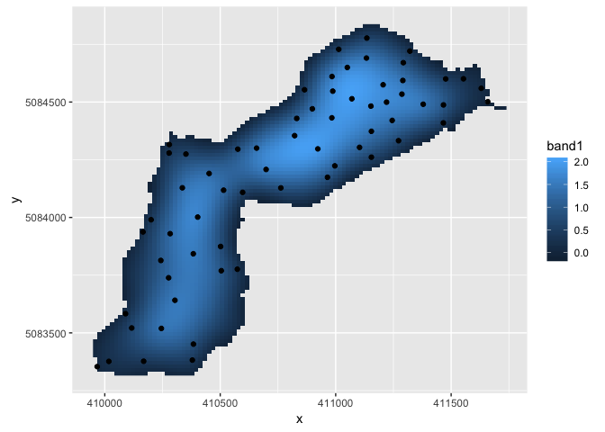
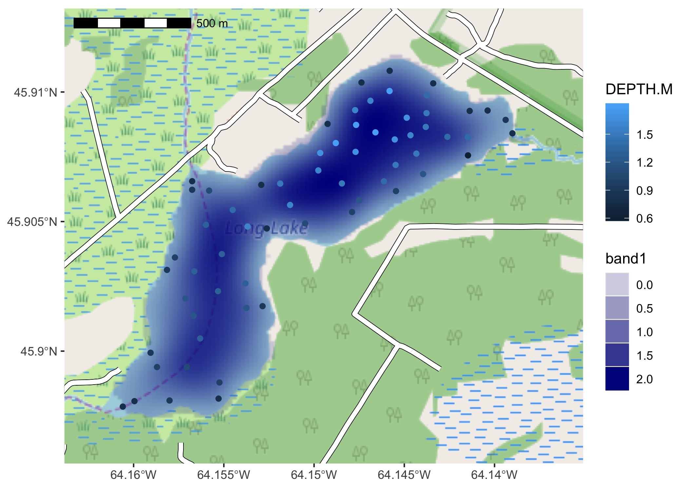
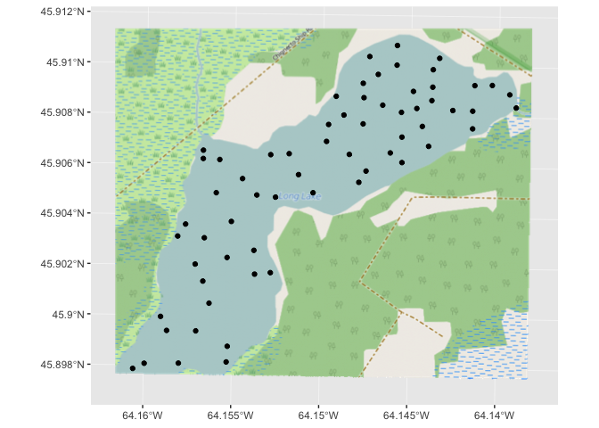
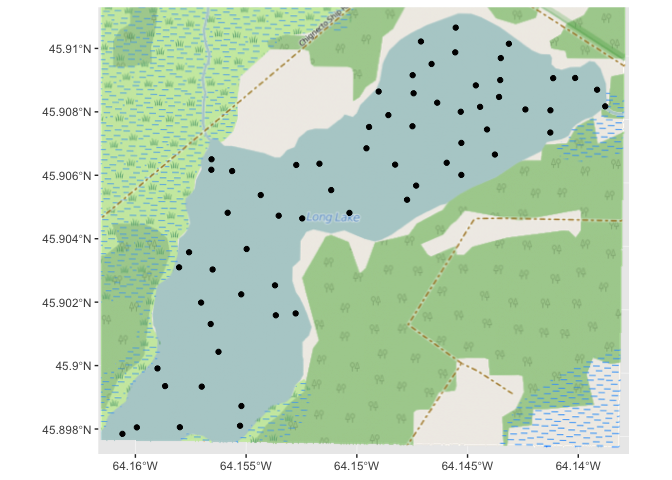

ggspatial: Spatial data framework for ggplot2
================

Spatial data plus the power of the `ggplot2` framework means easier mapping.

Installation
------------

The package is available on CRAN, and can be installed using `install.packages("ggspatial")`. The development version can be installed via `devtools`.

``` r
install.packages("devtools") # if devtools isn't installed
devtools::install_github("paleolimbot/ggspatial")
```

Introduction
------------

Currently, this package is in mega overhaul mode.

``` r
library(tidyverse)
```

    ## ── Attaching packages ───────────────────────────────────────────────────────────────────────────────────── tidyverse 1.2.1 ──

    ## ✔ ggplot2 2.2.1.9000     ✔ purrr   0.2.4     
    ## ✔ tibble  1.4.2          ✔ dplyr   0.7.4     
    ## ✔ tidyr   0.7.2          ✔ stringr 1.3.0     
    ## ✔ readr   1.1.1          ✔ forcats 0.2.0

    ## ── Conflicts ──────────────────────────────────────────────────────────────────────────────────────── tidyverse_conflicts() ──
    ## ✖ dplyr::filter() masks stats::filter()
    ## ✖ dplyr::lag()    masks stats::lag()

``` r
library(ggspatial)
```

    ## Loading required package: sf

    ## Linking to GEOS 3.6.1, GDAL 2.1.3, proj.4 4.9.3

``` r
load_longlake_data()
```

Using `df_spatial()`
--------------------

``` r
df_spatial(longlake_depthdf)
```

    ## # A tibble: 64 x 9
    ##         x       y feature_id WAYPOINT_I   LAT   LON DEPTH NOTES    DEPTH.M
    ##     <dbl>   <dbl> <fct>           <dbl> <dbl> <dbl> <dbl> <chr>      <dbl>
    ##  1 411659 5084501 1                2.00  45.9 -64.1  2.50 mouth o…   0.800
    ##  2 411630 5084560 2                3.00  45.9 -64.1  3.10 <NA>       0.900
    ##  3 411553 5084601 3                5.00  45.9 -64.1  2.50 <NA>       0.800
    ##  4 411476 5084600 4                6.00  45.9 -64.1  2.50 <NA>       0.800
    ##  5 411467 5084488 5                8.00  45.9 -64.1  4.50 <NA>       1.40 
    ##  6 411466 5084410 6               10.0   45.9 -64.1  2.00 <NA>       0.600
    ##  7 411379 5084490 7               12.0   45.9 -64.1  4.70 <NA>       1.40 
    ##  8 411321 5084721 8               16.0   45.9 -64.1  2.50 <NA>       0.800
    ##  9 411293 5084670 9               17.0   45.9 -64.1  4.70 <NA>       1.40 
    ## 10 411291 5084593 10              19.0   45.9 -64.1  5.00 <NA>       1.50 
    ## # ... with 54 more rows

``` r
df_spatial(longlake_depth_raster)%>%
  filter(!is.na(band1))
```

    ## # A tibble: 3,416 x 4
    ##         x       y  band1 feature_id
    ##     <dbl>   <dbl>  <dbl> <fct>     
    ##  1 411128 5084830 0.0378 166       
    ##  2 411146 5084830 0.0761 167       
    ##  3 411164 5084830 0.0885 168       
    ##  4 411182 5084830 0.0744 169       
    ##  5 411091 5084814 0.0491 264       
    ##  6 411109 5084814 0.129  265       
    ##  7 411128 5084814 0.189  266       
    ##  8 411146 5084814 0.224  267       
    ##  9 411164 5084814 0.231  268       
    ## 10 411182 5084814 0.212  269       
    ## # ... with 3,406 more rows

``` r
ggplot() +
  geom_raster(
    aes(x, y, fill = band1), 
    data = df_spatial(longlake_depth_raster) %>% filter(!is.na(band1))
  ) +
  geom_point(aes(x, y), data = df_spatial(longlake_depthdf)) +
  coord_fixed()
```



Using `layer_spatial()`
-----------------------

With `sf` (or `sp`) objects:

``` r
ggplot() +
  annotation_spatial(longlake_roadsdf, size = 1, col = "black") +
  annotation_spatial(longlake_roadsdf, size = 0.8, col = "white") +
  annotation_spatial(longlake_waterdf, fill = "lightblue", col = NA) +
  layer_spatial(longlake_depthdf, aes(col = DEPTH.M))
```



With RBG(A) rasters...

``` r
ggplot() +
  layer_spatial(longlake_osm) +
  layer_spatial(longlake_depthdf)
```



``` r
ggplot() +
  annotation_spatial(longlake_osm) +
  layer_spatial(longlake_depthdf)
```


