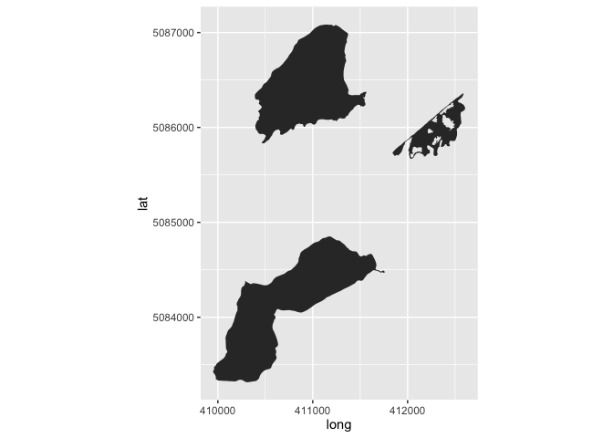
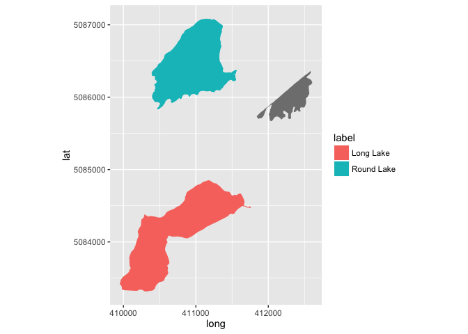
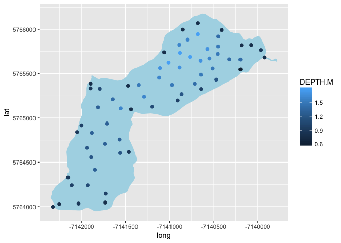
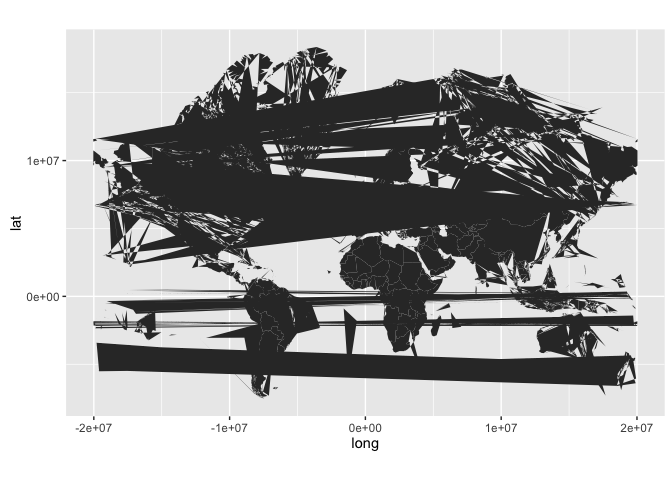

ggspatial: Spatial data framework for ggplot2
=============================================

Spatial data plus the power of the `ggplot2` framework means easier mapping for all! Unfortunately facetting with `scales="free"` doesn't work properly with `coord_fixed()`, so facetting is out if you want different extents in each facet window. But easy use of `ggplot2` with `sp`, `raster`, and basemaps through the `rosm` package is a go!

Installation
------------

The package isn't available on CRAN (yet!), but you can install it using `devtools::install_github()`.

``` r
install.packages("devtools") # if devtools isn't installed
devtools::install_github("paleolimbot/ggspatial")
```

Spatial objects
---------------

Many (but not all) objects of type `Spatial*` can be used with `ggplot`, but syntax is inconsistent and results vary. This package introduces a single `geom_` for use with `Spatial*` objects (e.g. `SpatialPointsDataFrame`, `SpatialLinesDataFrame`, `SpatialPolygonsDataFrame`...essentially what you get when you use `rgdal::readOGR()` to read any kind of spatial data). A few datasets are included in the package as examples.

``` r
library(ggspatial)
data(longlake_waterdf)
ggplot() + geom_spatial(longlake_waterdf, fill="lightblue") + coord_map()
```



If we examine `longlake_waterdf`, we can use the columns as aesthetics just as we would for a normal `data.frame`.

``` r
ggplot() + geom_spatial(longlake_waterdf, aes(fill=label)) + 
  coord_map()
```



A more useful use of this may be to examine a depth survey from Long Lake I took on for my honours thesis.

``` r
data(longlake_depthdf)
ggplot() + geom_spatial(longlake_waterdf[2,], fill="lightblue") +
  geom_spatial(longlake_depthdf, aes(col=DEPTH.M), size=2) + 
  coord_map()
```


Projections
-----------

If you've been trying this at home, you may have noticed that you get a little message for every non-lat/lon dataset you try to plot. `geom_spatial()` is spatially aware, and if you don't tell it otherwise, it will convert all of your input data to lat/lon. I made this the default because `ggplot` has the nice `coord_map()` function that helpfully projects things that happen to be in lat/lon format (and communicates your intent more clearly). If you're working in the polar regions or near the international date line, it's unlikely that this what you want. To get around the default projection, you can specify your own using `toepsg` or `toprojection`. For example, the previous plot could be rendered to the Google Mercator projection by passing `toepsg=3857` (note that you'll have to do this for all the layers).

``` r
data(longlake_depthdf)
ggplot() + geom_spatial(longlake_waterdf[2,], fill="lightblue", 
                        toepsg=3857) +
  geom_spatial(longlake_depthdf, aes(col=DEPTH.M), size=2,
               toepsg=3857)
```



Rasters
-------

Rasters are still a work in progress, but the idea is that you use a similar function to plot a raster layer.

``` r
ggplot() + geom_spraster(longlake_osm)
```

    ## Warning: no function found corresponding to methods exports from 'raster'
    ## for: 'overlay'



The shortcut
------------

As a convenience, there's a `ggspatial()` function, that currently just calls `ggplot()` for you and adds a `geom_spatial()` using its arguments. Eventually, I'd like this to set some parameters for all subsequent layers, but that will have to wait until another thesis break...

``` r
ggspatial(longlake_waterdf, fill="lightblue") +
   geom_spatial(longlake_marshdf, fill="grey", alpha=0.5) +
   geom_spatial(longlake_streamsdf, col="lightblue") +
  coord_map()
```


Ongoing development
-------------------

This package is currently undergoing a major overhaul in preparation for release in April 2017, so keep an eye on the version number before you go crazy using it! In the works are:

-   Raster RGBA support (important for hillshading)
-   Smarter use of `Stat` and `Geom` and `Coord` to avoid extra work
-   A unifying `ggspatial()` function to create a map quickly.

That's it! Enjoy!
